# 3awedlou · Web app

Dashboard for the 3awedlou smart PET recycling machine.

Built with **React 18 + Vite 5 + TypeScript** — no UI framework, custom design
system in `src/styles` (brand green identity).

The app talks to the **same Symfony backend as the mobile app** — one API, one
JWT scheme, one contract (see [`../backend/docs/api-contract.md`](../backend/docs/api-contract.md)).

## Run it

1. Start the Symfony backend (see [`../backend/README.md`](../backend/README.md)) — by default on
   `http://127.0.0.1:8000`.
2. Create `.env` (or copy `.env.example`):

   ```ini
   VITE_API_BASE_URL=http://127.0.0.1:8000/api
   VITE_REALTIME_URL=
   VITE_ENVIRONMENT=development
   ```

3. `npm install && npm run dev` → http://localhost:5173

Dev accounts (loaded by backend fixtures, dev only): `anouer@3awedlou.app` /
`3awedlou-dev`.

| Command | What it does |
|---|---|
| `npm run dev` | Vite dev server on :5173 |
| `npm run build` | Type-safe production build (`dist/`) |
| `npm run preview` | Preview the production build |

## Architecture

```
src/
├── api/
│   ├── client.ts            # fetch + Bearer token + envelope + 401 flow (single seam)
│   ├── auth.ts              # login / register / me / logout
│   └── machines.ts          # machines, telemetry, sessions, production, recycling, commands
├── realtime/
│   └── realtimeService.ts   # connect/subscribe/onTelemetry — polling today, WS later
├── types/
│   └── api.ts               # API contract types (mirror of mobile-app/data/api.ts)
├── contexts/
│   ├── AuthContext.tsx      # login / register / session restore / single logout path
│   ├── MachineContext.tsx   # API-backed machine state (sensors, sessions, alerts)
│   ├── ThemeContext.tsx     # light/dark/system theme
│   └── ToastContext.tsx     # toasts
├── pages/                   # Dashboard, Machine, Recycling, Filament, Impact, History, Settings, Login
├── components/              # layout, ui kit, charts, icons
├── lib/                     # router (hash), format, csv, useAsync
└── data/types.ts            # UI-only types + re-exports of the contract
```

Key rules:

* **One API contract** — `src/types/api.ts` mirrors the backend exactly; never
  invent field names locally.
* **Auth is centralized** — components never read tokens; `api/client.ts` attaches
  the Bearer token, `AuthContext` owns the session, 401 → single logout path.
* **Machine actions are guarded commands** — start/pause/resume/stop go through
  `POST /machines/{id}/commands`; the backend validates state and safe ranges
  before anything reaches hardware.
* **No fabricated data** — sensors show what the machine last reported; totals
  come from measured recycling records; estimates (bottles, CO₂e) are labelled.
* **Honest realtime** — without a realtime URL the dashboard polls every 10 s
  (`REFRESH_MS = 10_000` in `src/realtime/realtimeService.ts`) and says so in
  the UI; `RealtimeService` is already the WebSocket contract.

## Data flow

**Telemetry (machine → dashboard):**

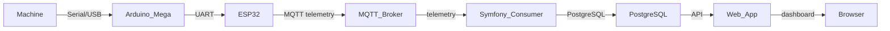

**Commands (dashboard → machine):**

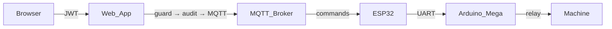

Rules: **Web/Mobile never talk to MQTT or to the machine or to each other.**
Symfony is the single backbone. The **Arduino Mega** keeps deterministic machine
control; the **ESP32** only does networking. Arrows shown are the ones that
exist today; everything else is planned.

## Implemented / Prepared / Future

| Area | State |
|---|---|
| HTTP API surface (auth, machines, telemetry, sessions, commands) | Implemented |
| Telemetry ingestion pipeline (`TelemetryProcessor`) | Implemented |
| Authorised machine commands with backend guard + audit | Implemented |
| MQTT transport (publisher + `app:mqtt:consume` consumer) | Implemented (backend) |
| Local Mosquitto dev broker with per-device ACL | Implemented (dev only) |
| Device acknowledgement | Prepared — `commandId`/`expiresAt` on the wire; `deviceAcknowledged` stays false until firmware acks |
| Device-originated events | Prepared |
| Realtime transport (WebSocket/SSE/Mercure behind `RealtimeBroadcaster`) | Prepared — both frontends program against the final interface and poll honestly |
| ESP32 firmware, incl. device-side auth | Future — not in this repo |

## Prerequisites

| Tool | Version |
|---|---|
| Node.js | ≥ 18 (see `engines` in `package.json` — no engine constraint declared) |
| npm | ≥ 9 (ships with Node ≥ 18) |

> Project `package.json` does not declare engines; these are the versions used
> to build this checkout. Install with `nvm install 18` / `nvm use 18`.

## Configuration

| Variable | Required | Default | Meaning | Example placeholder |
|---|---|---|---|---|
| `VITE_API_BASE_URL` | yes | `http://127.0.0.1:8000/api` | Symfony API base; the **same** backend the mobile app uses | `http://YOUR_LAN_IP:8000/api` |
| `VITE_REALTIME_URL` | no | *(empty)* | WebSocket/SSE endpoint; **empty = polling** every 10 s, not fake realtime | `ws://127.0.0.1:8080/ws` |
| `VITE_ENVIRONMENT` | no | `development` | Shown in the UI footer, used for log verbosity | `production` |

No secrets are used by the client. `VITE_*` values are embedded in the bundle at
build time, so **never** put credentials here — this app has none. Local
overrides go in `.env` (git-ignored).

## Project structure

```text
.
├── public/                  # Vite static assets (copied as-is to `dist`)
├── scripts/                 # repo scripts
├── docs/
│   └── screenshots/         # exported PNGs, dark + light variants
├── src/
│   ├── api/                 # fetch wrappers + endpoint contracts (client, auth, machines)
│   ├── components/          # layout, ui kit, charts, icons
│   ├── contexts/            # Auth / Machine / Theme / Toast providers
│   ├── data/                # UI-only types + re-exports of the backend contract
│   ├── lib/                 # hash router, formatters, csv, useAsync
│   ├── realtime/            # RealtimeService (polling today, WS contract later)
│   ├── styles/              # CSS tokens + component styles (brand green)
│   ├── types/               # API contract TypeScript types (single copy)
│   ├── App.tsx              # providers + routing
│   └── main.tsx
├── index.html
├── package.json
├── tsconfig.json
├── vite.config.ts
├── docs/screenshots/*.png # run `npm run screenshot-gallery` to regenerate
└── README.md
```

## Scripts / commands

| Command | What it does |
|---|---|
| `npm run dev` | Start the Vite dev server |
| `npm run build` | Production build to `dist/` |
| `npm run preview` | Preview `dist/` locally |

## Screenshots

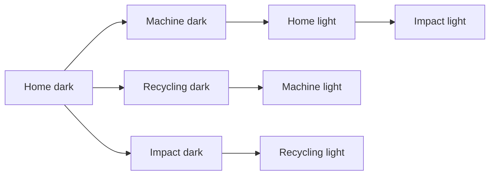

| Dark | Light |
|---|---|
| 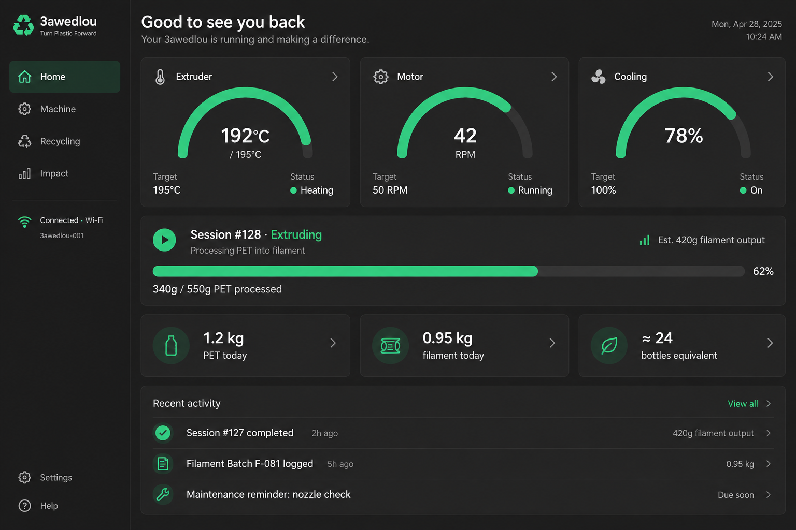 | 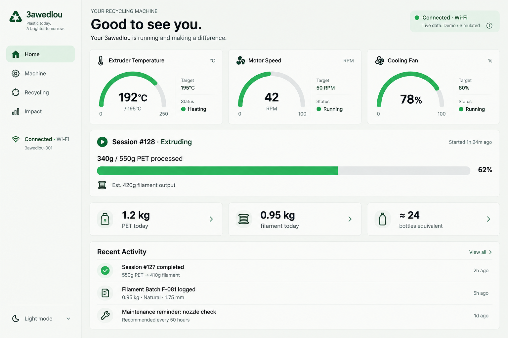 |
| 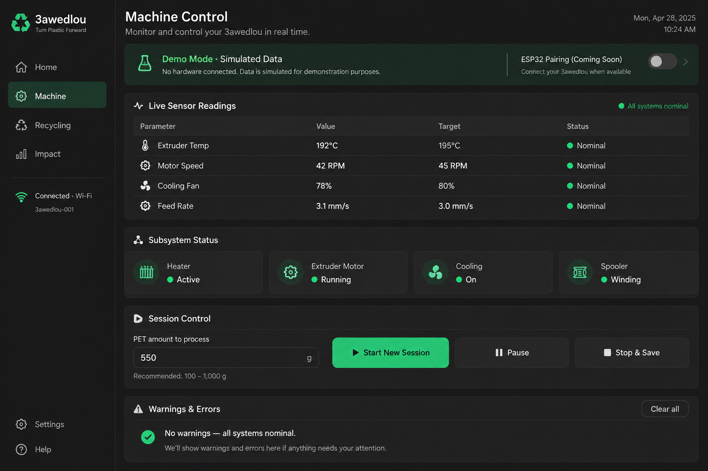 | 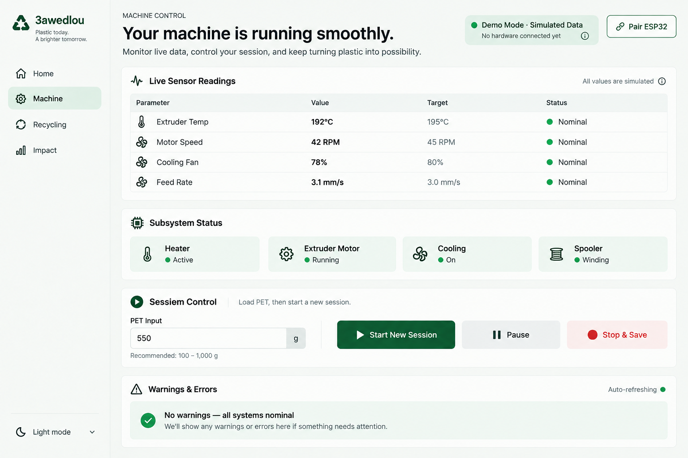 |
| 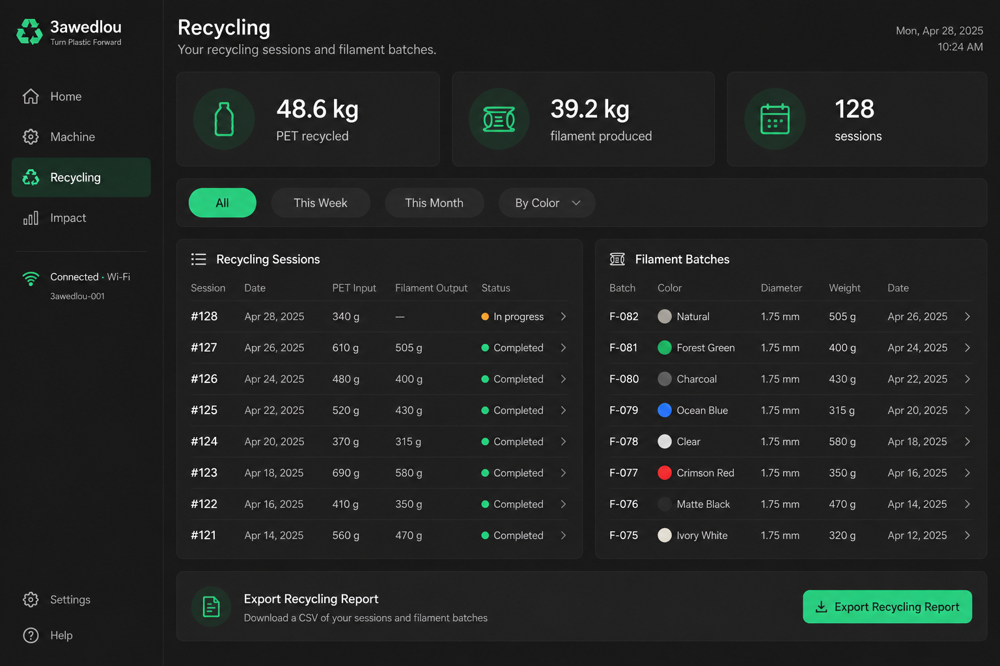 | 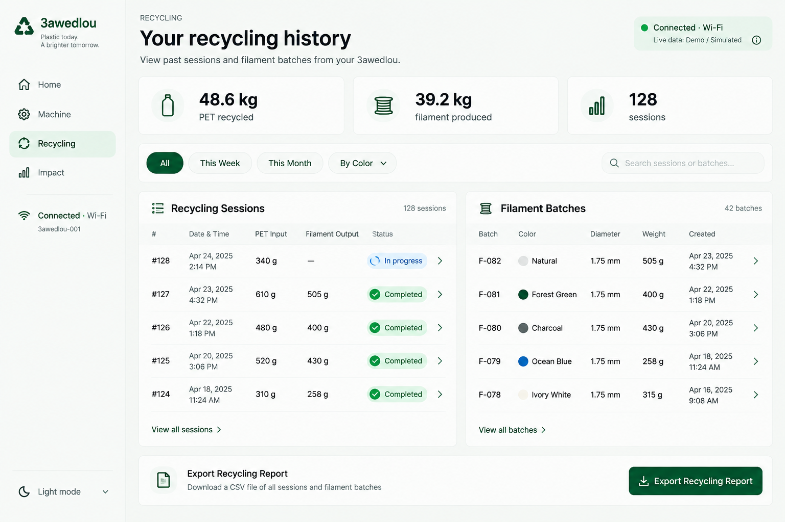 |
| 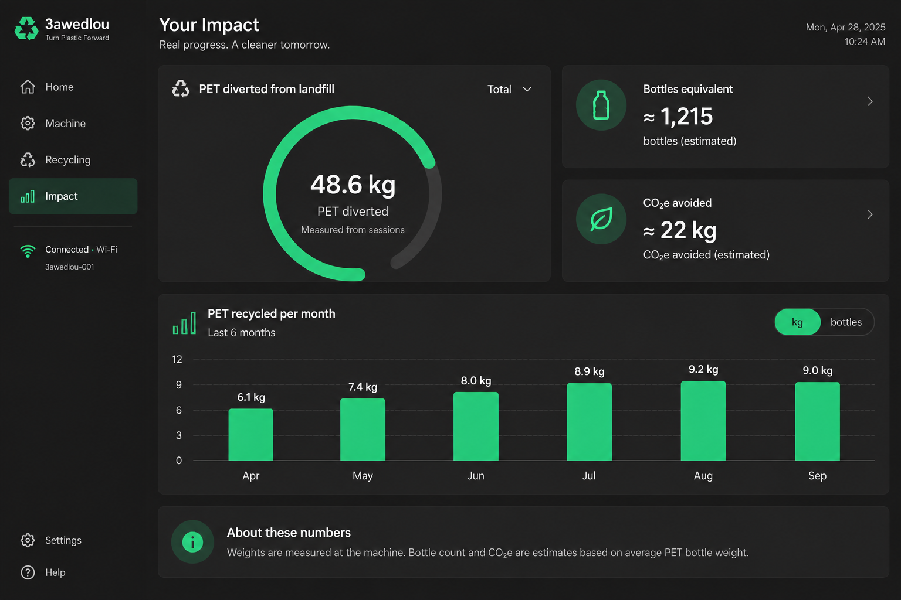 | 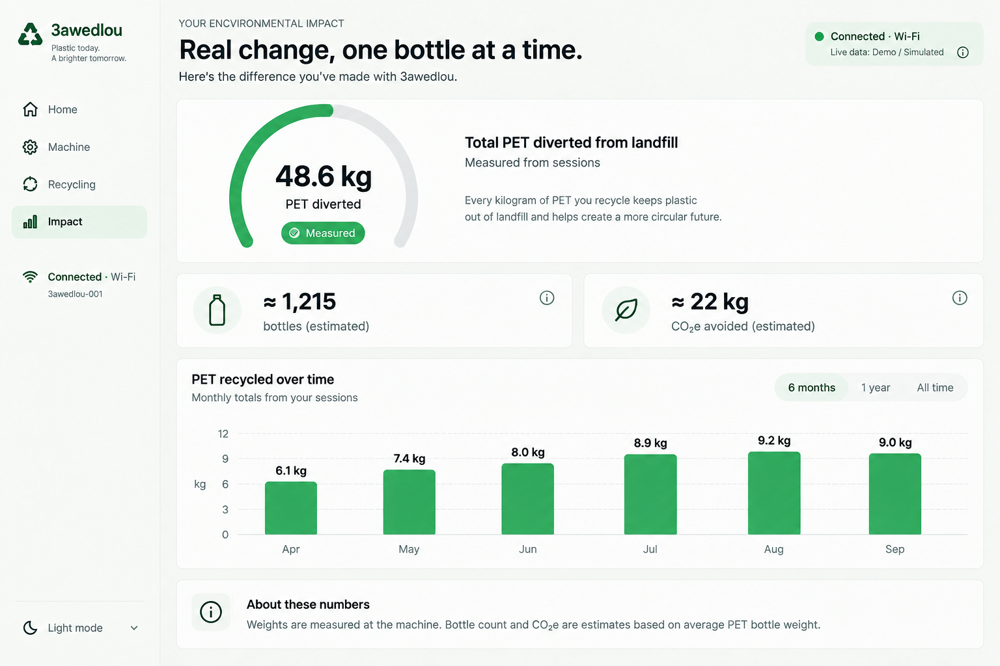 |

Export a fresh set with `scripts/downscale-png.mjs` once a screenshot export command is wired in `scripts/` (not implemented yet) — the images above are the committed ones.

Client-side tests are **not** wired in this checkout: `npm test` is not defined.
Run `npm run build` to verify it type-checks and bundles; `npm run preview` to
smoke-test the production build. Linting and typechecking are `tsc --noEmit`
via `tsc` on the `tsconfig` include (`src`). The CI contract (typecheck on CI,
no `main` changes) is the same for all three software repos.

## Troubleshooting

| Symptom | Likely cause | Fix |
|---|---|---|
| Phone cannot reach the API | Backend only listens on `127.0.0.1` | Start the backend with `symfony serve --no-tls --allow-all-ip` (or `php -S 0.0.0.0:8000`); set `VITE_API_BASE_URL` to the PC's **LAN IP**, never `localhost` |
| API unreachable from the phone | Windows Firewall blocks port 8000 | Allow inbound `Node.js` / `Port 8000` on **Private** network profile |
| `npm run dev` fails with `EADDRINUSE:address already in use` | Another process on :5173 | `npx kill-port 5173` or use the `port` CLI option |
| CORS errors on login | `CORS_ALLOW_ORIGIN` too narrow | Match `VITE_API_BASE_URL` origin in backend `.env.local` |
| Two PostgreSQL containers / `symfony serve` overriding `DATABASE_URL` | Backend `compose.yaml` and `symfony serve` both inject a DB | Run `bash bin/dev-check` (Git Bash) or `.\bin\dev-check.ps1`; prefer Docker Postgres and run `symfony serve` with `DATABASE_URL` fixed, or stop the extra container |
| `php` not on `PATH` in a new PowerShell window | PHP is not added to the system `PATH` | Run `php.exe` from its install path or add XAMPP/Git-Bash PHP to `PATH`; close and reopen the window |
| OpenSSL `No such process` when generating JWT keys on Windows | `OPENSSL_CONF` not set | `set OPENSSL_CONF=C:\Program Files\OpenSSL-Win64\bin\openssl.cfg` then generate keys |
| `429` from the login rate limiter | Too many failed logins | Wait `Retry-After` seconds, or close the limiter in `config/packages/rate_limiter.yaml` for local debugging |
| `npm start -- -c` after `.env` change | Vite does not reload env without restart | Restart the dev server after changing `.env` |
| JSON pipe test fails (Windows PowerShell) | `.ps1` without UTF-8-BOM parses in PS 5.1 | Save the `.ps1` as **UTF-8 with BOM** or run the test via the `-File` variant (see `bin/dev-check.ps1`) |
| `.env` password with special characters breaks the app | Dotenv parses unquoted special chars | Quote the value (e.g. `DATABASE_URL="postgres://...@host:5432/db"`) |
| `deviceAcknowledged` is always `false` | No firmware ack channel implemented yet | Expected until a firmware ack exists |

## Security notes

* Owner/device isolation is enforced by `MachineAccess` (ownership check) and
  the `deviceTokensEnabled` kill switch.
* Device tokens are hashed at rest; JWT is RS256, 1 h TTL, refresh token
  (single-use, revocable) via `gesdinet/jwt-refresh-token-bundle`.
* Auth surface is rate-limited (login 5/5 min, register 3/10 min per IP).
* **Never commit** `.env.local`, JWT keys (`config/jwt/*.pem`) or broker
  passwords — all are git-ignored.
* The dev broker is **loopback-only** (127.0.0.1:1883, plaintext, `MQTT_TLS=false`).
  TLS + per-device credentials are required before any deployment and are not
  implemented here.

## Roadmap

1. **Core API** — auth, machines, telemetry, sessions, production, recycling
   *(done, verified locally)*
2. **Guarded commands + audit** — backend-safe command dispatch
   *(done, verified locally)*
3. **MQTT broker integration** *(done and verified locally: telemetry in,
   commands out, ACL isolation, 503 when the broker is down)*
4. **ESP32 + Arduino Mega serial gateway** — planned; bench wiring exists,
   bench test pending, protocol not yet defined
5. **Device authentication** — device tokens
6. **Realtime transport** — WebSocket/SSE hub
7. **Push notifications**
8. **Admin back-office**
9. **Deployment** — Docker image, CI/CD, TLS
10. **Helpdesk / operation tooling**

**Current position:** phases 1–3 are done. Phases 4–10 are pending and
documented as TODO(anouer) markers in this README.

## Related docs

* API contract: [`docs/api-contract.md`](docs/api-contract.md)
* MQTT contract: [`docs/mqtt-contract.md`](docs/mqtt-contract.md)
* Backend: [`../backend/README.md`](../backend/README.md)
* Mobile: [`../mobile-app/README.md`](../mobile-app/README.md)
* Hardware: [`../pet-recycling-filament-system/README.md`](../pet-recycling-filament-system/README.md)

## License

TODO(anouer): no LICENSE file found in this repo — add one.
